# 📉 Customer Churn Analysis using Python

> Exploratory Data Analysis (EDA) on the Telco Customer Churn dataset to identify patterns and key factors driving customer attrition.

---

⭐ If you like this project, consider giving it a star!

---

## 📌 Project Overview

| Item | Detail |
|------|--------|
| **Dataset** | IBM Telco Customer Churn — Kaggle |
| **Records** | 7,043 customers |
| **Features Analyzed** | 21 (demographics, services, billing, churn) |
| **Techniques Used** | EDA, Data Visualization, Outlier Detection |
| **Libraries** | Pandas, NumPy, Matplotlib, Seaborn, SciPy |

---

## 📁 Project Structure

```
customer-churn-analysis-python/
│
├── main.py                        # Main analysis script
├── requirements.txt               # Project dependencies
├── README.md                      # Project documentation
├── .gitignore                     # Ignore unnecessary files
│
├── data/                          # Dataset files
│   └── telco_churn.csv
│
└── plot/                          # Generated visualizations
    ├── churn_count.png
    ├── churn_percentage.png
    ├── churn_gender.png
    ├── churn_senior.png
    ├── seniorcitizen_percentage.png
    ├── contract_churn.png
    ├── payment_method.png
    ├── services_analysis.png
    ├── tenure_hist.png
    ├── boxplot_MonthlyCharges.png
    ├── boxplot_tenure.png
    ├── boxplot_TotalCharges.png
    └── correlation_heatmap.png
```

---

## ✨ Key Features

- 🧹 **Data Cleaning & Preprocessing** — handled missing values, corrected data types, removed inconsistencies
- 📊 **Exploratory Data Analysis (EDA)** — univariate, bivariate, and multivariate analysis
- 🎨 **Data Visualization** — 13 rich plots using Seaborn & Matplotlib
- 🔥 **Correlation Heatmap** — identified feature relationships and multicollinearity
- 🔎 **Outlier Detection** — using both Z-Score and IQR methods
- 👤 **Customer Behavior Analysis** — across tenure, contract type, services, and payment method

---

## 💡 Key Insights

| # | Insight |
|---|---------|
| 1 | 📅 **Month-to-month** contract customers churn the most |
| 2 | 👴 **Senior citizens** have a significantly higher churn rate |
| 3 | ⏳ Customers with **low tenure** (new customers) are most likely to leave |
| 4 | 🛡️ **Value-added services** (tech support, online backup) reduce churn |
| 5 | 💳 **Electronic check** users show higher churn than other payment methods |

---

## 📊 Sample Visualizations

### 📈 Churn Overview
| | |
|---|---|
| 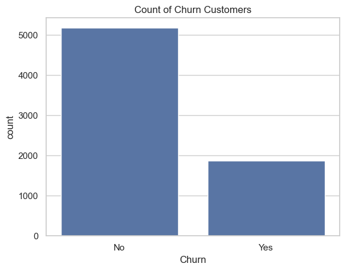 | 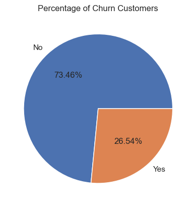 |

### 👤 Customer Demographics
| | |
|---|---|
| 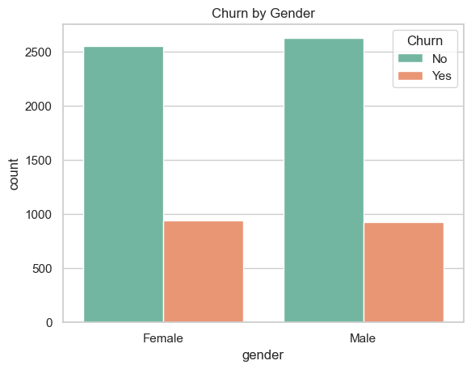 | 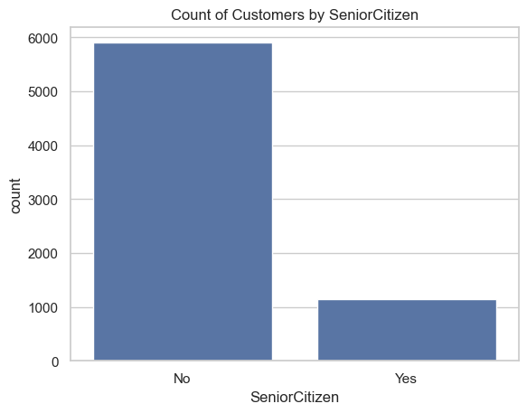 |
| 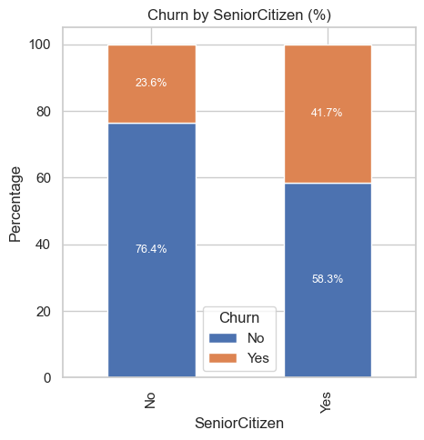 | |

### 📋 Contract & Payment
| | |
|---|---|
| 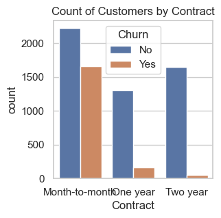 | 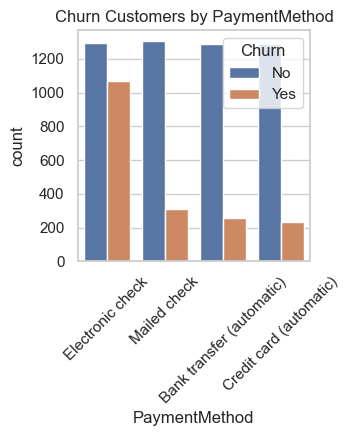 |

### 🛠️ Services & Tenure
| | |
|---|---|
| 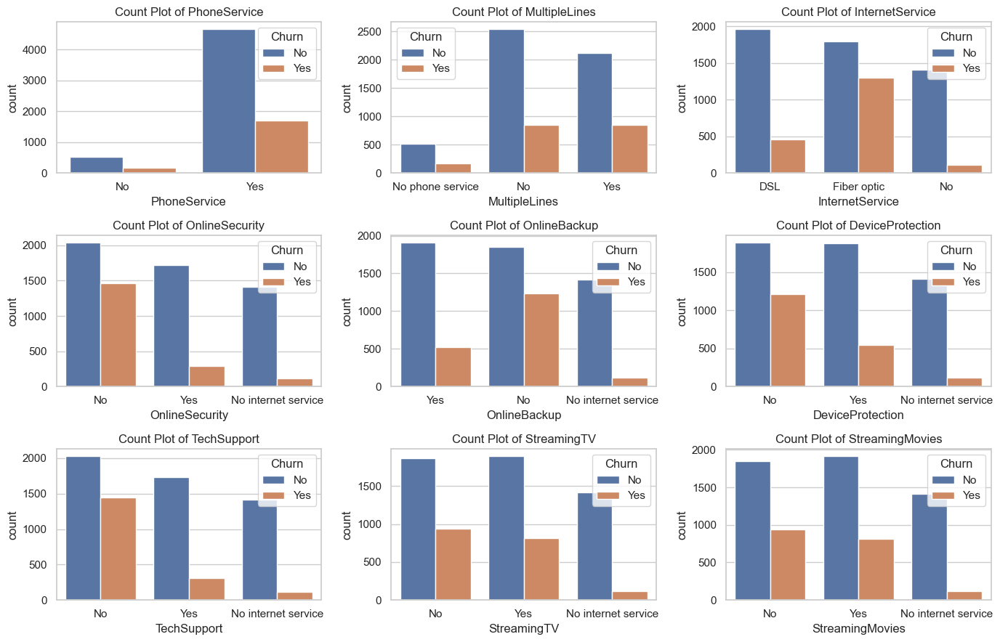 | 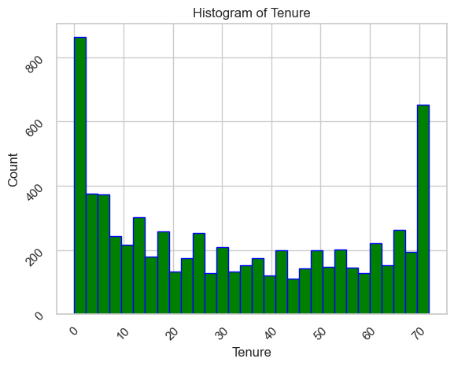 |

### 📦 Outlier Detection (Boxplots)
| | | |
|---|---|---|
| 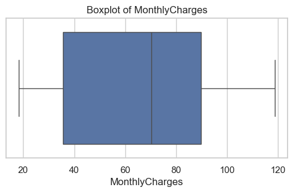 | 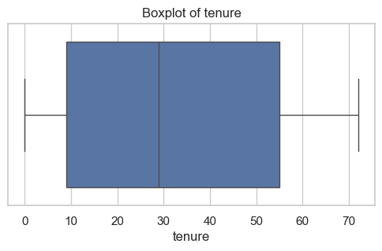 | 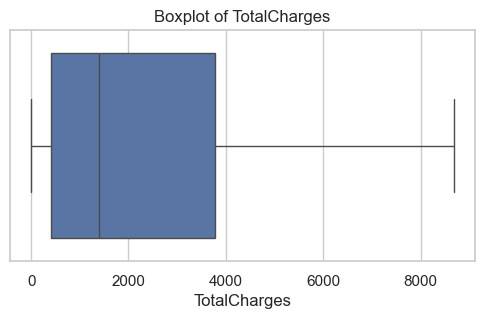 |

### 🔥 Correlation Heatmap
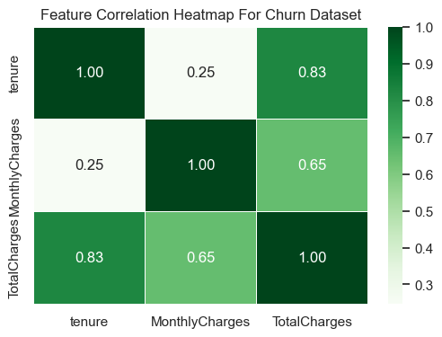

---

## 🛠️ Tech Stack


---

## 🚀 How to Run

```bash
# 1. Clone the repository
git clone https://github.com/Shashank-Kumar45/customer-churn-analysis-python.git

# 2. Navigate into the folder
cd customer-churn-analysis-python

# 3. Install required libraries
pip install -r requirements.txt

# 4. Run the analysis
python main.py
```

> 📌 All generated plots will be saved automatically in the `plot/` directory.

---

## 🔮 Future Scope

- [ ] Build a **churn prediction model** using Logistic Regression or Random Forest
- [ ] Handle class imbalance using **SMOTE**
- [ ] Add an **interactive dashboard** using Plotly or Streamlit
- [ ] Perform **feature engineering** to improve predictive power
- [ ] Include **customer segmentation** using K-Means clustering
- [ ] Deploy the model as a **web app** using Flask or Streamlit

---

## 👤 Author

**Shashank Kumar**
B.Tech CSE
📧 Connect on [LinkedIn](https://www.linkedin.com/in/shashank-kumar02/)

---

## 📄 License

This project is open source and available under the [MIT License](LICENSE).
